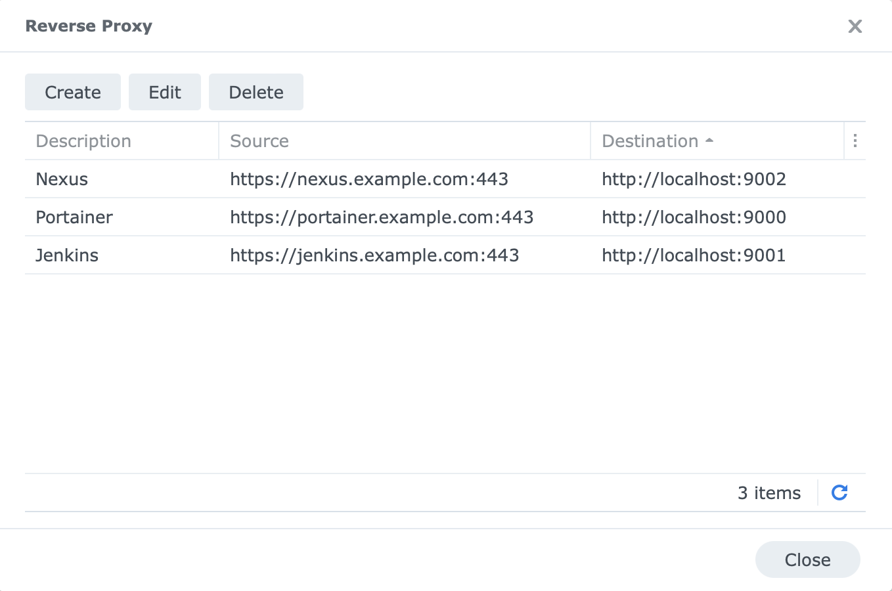
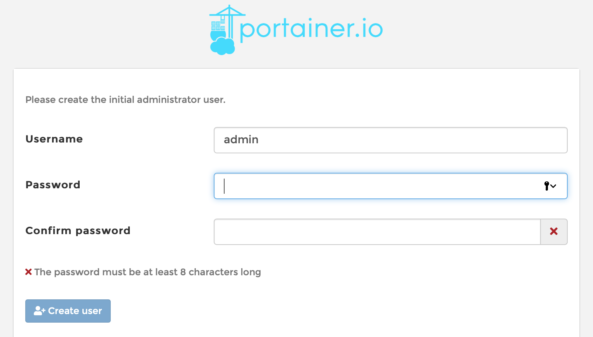
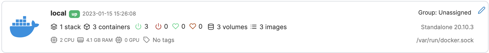

# Installation
## Synology Preparation
### Install Docker and Web Station
Go to the packet manager and install the packages `Web Station` and `Container Manager` (actually Docker and docker-compose under the hood).  
If your Synology does not support the Container Manager, then this project is not for you.

### Setup the directory for your project and data
Create a directory in the existing share `docker`, and name it `synology-docker-services`.  
Download the file `docker-compose.yml` from this project and copy it into this directory.


### Create the project in Container Manager
Open the `Container Manager`, select `Project` on the left, and then click on `Create`. Set the desired name and then click on `Set Path`

A pop-up will show and ask on using the detected `docker-compose.yml`. Click `Ok` to confirm.

Click `Next` until you are asked about `Web Portal Settings`. Enable one of the services for now, `portainer`.
Make sure to select `https` (default is `http`), because most modern browser will have issues with http.

Click `Done` and wait for the services to start up.


### Setup the Synology Reverse Proxy
Today's browsers do not like unencrypted web sites. To solve this problem, the Synology reverse proxy can be used to redirect traffic from a friendly URL such as `https://jenkins.example.com` to the non-encrypted site running as a docker container (such as `http://synology.example.com:9001`). As an additional bonus you do not have to remember all of the port numbers.

To set this up, go to the "Login Portal" in the Synology Control Panel. Select the "Advanced" tab and then click the "Reverse Proxy" button.


Add three entries, so that it looks similar to this picture:



Of course you have to use a proper domain name that works in your intranet. The setup of such an infrastructure is beyond this project. Since you have a Synology (or you would not use this project), I recommend to use the DNS Server package. If everything else fails, you can always hardcode the three DNS names into the `hosts` file of your development computer.

The port numbers (9000, 9001 and 9002) are defined in the `docker-compose.yaml` file. If you want to change them, you can. 

## Download the Project files to the Synology
### Login to the Synology
* Login to the Synology. How this is done depends on your platform.
  * On a Mac or Linux system, use `ssh synology.example.com` (the name is just an example, you have to use the name of your Synology).  
  * On Windows, an SSH client must be used, such as putty. You can also use `ssh`in the Windows Subsystem for Linux.
  
## Clone the Project
* Once you are logged in, change into the `docker` directory. Often this is `/volume1/docker` but this can change if you have more than one volume defined.
* Once in the directory, clone the repository: `git clone https://github.com/tinue/synology-docker-services.git`
* If you get an error message similar to `Could not create directory '/var/services/homes/me/.ssh'` then the `user home service` is not enabled on your Synology. For this project, this is irrelevant and the error message can be ignored.
* Change into the directory: `cd synology-docker-services` and see if the files are present: `ls -la`.

# Startup
## Start the Servers
* This command starts all of the servers: `sudo docker-compose up -d`.

## Check if the servers are running
Open the Docker package on the Synology. You should see all three containers running.
 


# First Start
Technically we are finished now: The servers are running. Nevertheless, here are a few hints to get you started using the services.
## Portainer
Portainer shuts down automatically after a few Minutes if you don't access it and set an administrator password. Therefore, go ahead and access it with your web browser: `https://portainer.example.com`.

Enter an admin password:



Next, create a local connection (click on "Get Started"):


If all goes well, you will see your containers:



## Jenkins
Type `sudo docker logs jenkins` to see the log output of Jenkins. It will take a long time for Jenkins to be ready. You need to see this line before you can continue:
```
INFO: Jenkins is fully up and running
```
 
 
There will also be a line similar to:
```
Please use the following password to proceed to installation:

75552df4d95248b4a7b21436cdbc872c
```
Open Jenkins in your web browser. Copy the password from the logfile and paste it into the login form.

## Nexus
Nexus used to have a default admin user. Way too many users didnt bother to update the password after the first logon, so this was recently changed. According to the documentation "the uniquely generated password can be found in the `admin.password` file inside the volume."

This means we need to get access to the volume, and read this file.
The simplest way that I found is to use Portainer in order to open a command prompt inside of Nexus.
Then simply type `cat sonatype-work/nexus3/admin.password` and copy the result to the clipboard.

Next, open Nexus in a web browser: `https://nexus.example.com`. Click "Sign in" in the top right corner. The user is "admin", and the password is in the clipboard. The password needs to be changed right away.

## MariaDB
Nothing to configure here. Once started, there will be a MariaDB database engine running on the Synology.
Connection to the database will be not encrypted, but for a development server this is fine.  
To access the database, a client is required. One option is to use the command line client `mysql`.
On a Mac, it can be installed with `brew install mysql-client`. Another option is a web based GUI such as
Adminer (see next paragraph).
Note that the MariaDB root password is in the docker-compose-yaml file. This is not very secure, but again
for a personal development server this should be fine.

## Adminer
Adminer is a simple web based database client. There is nothing more to install. Simply fill in the
respecting fields in the login panel. Note that you need to give the full name of the Synology machine
in the "Server" fields. Something like `localhost` will not work.   


# FAQ
* Why do the docker commands require `sudo`?
  * On Linux systems, this can be avoided by adding the user to the `docker` group. On a Synology this is a tad more complicated:
    * Create a docker user group: `sudo synogroup --add docker`
    * Change the owner group of the docker.sock file: `sudo chown root:docker /var/run/docker.sock`
    * Add your user to the new docker group: `sudo synogroup --member docker $USER`
    * After this, end the SSH session and reconnect.
* Can the development server be hacked?
  * Possibly: If someone gains access to the Docker socket, then this person is for all practical purposes a `root` user of the entire Synology. The images `Jenkins` and `Portainer` need access to the Docker socket to function. In addition, `Portainer` runs as `root`. All of this combined means that if someone can hack `Jenkins` or `Portainer`, then this person has unlimited access to the Synology DiskStation. This is why this project is about a *private* development server, and not a public one. Operate the Synology behind a firewall only!
* How can I reset my servers?
  * For a full reset, you have to delete all volumes. This can be done easily by shutting down like this: `sudo docker-compose down -v`.
  * For a partial reset, you can manually delete the matching volume. Use `sudo docker volume ls` to list the existing volumes. Then use `sudo docker volume rm [volumename]` to delete. For example, `sudo docker volume rm synologydevserver_jenkins_home` resets Jenkins.
* Do I need Portainer?
  * No, you can instead use the GUI of the Synology Docker package. Just remove the "Portainer" part of the `docker-compose.yaml` file, and also remove the `depends-on` sections in the two other services. Strictly speaking, the `depends-on` is incorrect anyway. I just wanted Portainer to be up and running before the other packages start up.
* How do I backup the data?
  * TODO: Provide an answer
* How can I upgrade the packages?
  * `sudo docker-compose pull && sudo docker-compose up -d`.
  * TODO: Automatic upgrades
* What is this: `user: "1000:0"` in the Jenkins service description?
  * Jenkins by default runs as `uid:gid` `1000:1000` (most docker packages simply run as `root`, or `0:0`). Unfortunately, this does not allow Jenkins to access the Docker socket of the Synology Docker daemon, only root can do this. The simplest workaround is to start Jenkins with a group-id of zero, or `root`.