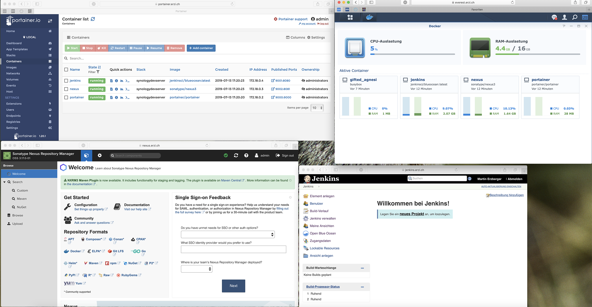

# Synology Development Server
Use a Synology DiskStation as a private Java development server:
* [Jenkins](https://jenkins.io) to automate builds
* [Nexus](https://www.sonatype.com/nexus-repository-sonatype) repository manager
* [Portainer](https://www.portainer.io) Docker manager
* [MariaDB](https://mariadb.com) Database Engine
* [Adminer](https://www.adminer.org) Web based GUI for MariaDB

Click [here](INSTALL.md) for installation instructions.

# Release History
* 1.0.0, 2019-07-13: First version
* 1.1.0, 2023-01-15: Add MariaDB; Updates to reflect Synology Disk Station Manager v7.