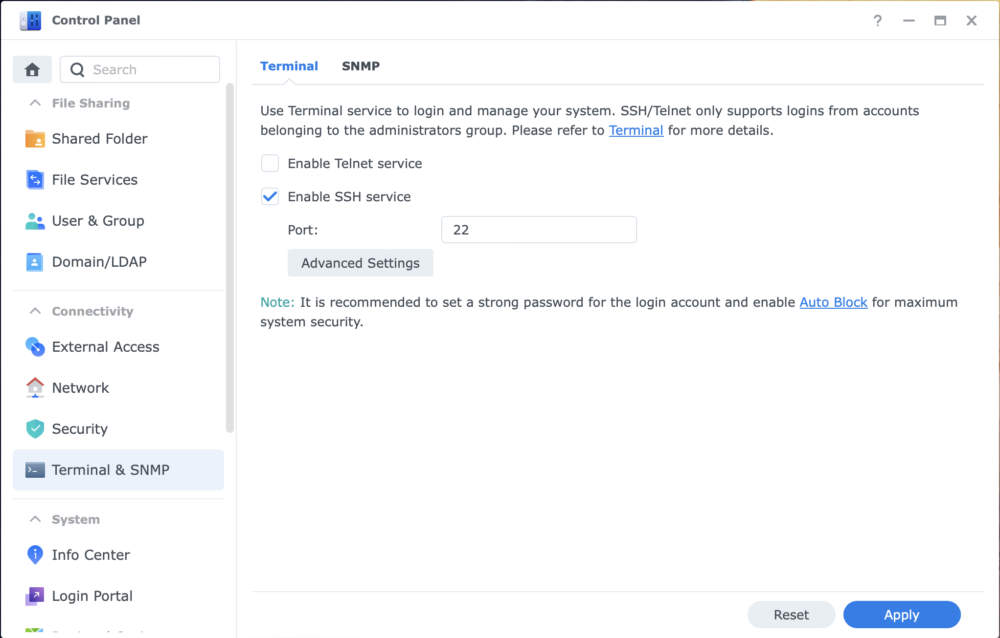

# Synology Development Server
Use a Synology DiskStation as a private Java development server:
* Jenkins to manage builds
* Nexus to manage and cache packages
* Administrative tools to support operation (Portainer)

# Synology Preparation
## Docker
First, install the "Docker" package:   

The installation will create a new folder named "docker". This is where all of the docker related files go. Initially, the folder is empty: .

## Enable Secure Shell Login
While it would be possible to use the Synology Docker GUI to download and setup all of the containers, this project uses docker-compose instead. This means that the command line is used, and this must be enabled first.
* Open the Control Panel. Enable "Advanced Mode" if it is not enabled yet.
* Then, select "Terminal & SNMP" and check the box for "Enable SSH service".
* Click "Apply".

.

## Install Git on the Synology
* Go to the package manager again, and install the package "Git Server". The package does not have to be configured or set-up in any way, it's just here to get the `git` command.

## Login to the Synology
* Login to the Synology. How this is done depends on your platform.
  * On a Mac or Linux system, use `ssh 192.168.243.48` (the IP address is just an example, you have to use the address of your Synology).  
  * On Windows, an SSH client must be used, such as putty. You can also use the Linux subsystem of Windows 10 and there use `ssh`.
  
## Clone the Project
* Once you are logged in, change into the `docker` directory. Often this is `/volume1/docker` but this can change if you have more than one volume defined.
* Once in the directory, clone the repository: `git clone git@github.com:tinue/SynologyDevServer.git`
* If you get an error message similar to `Could not create directory '/var/services/homes/me/.ssh'` then the `home` directory support is not enabled on your Synology. For this project, this is irrelevant and the error message can be ignored.
* Change into the directory: `cd SynologyDevServer` and see if the files are present: `ls -la`.

## Start the Servers
* This command starts all of the servers: `docker-compose up -d`.

## Check if the servers are running
Open the Docker package on the Synology. You should see all three containers running. 

# TODO
* Bind-Mount docker socket
* Explain Jenkins login (docker logs jenkins)
* Explain Portainer login (shutdown after a few minutes)

# FAQ
* Why do the docker commands require `sudo`?
  * On Linux systems, this can be avoided by adding the user to the `docker` group. On a Synology this does not work, unfortunately.
* Can this be hacked?
  * Possibly: If someone gains access to the Docker socket, then this person is for all practical purposes a `root` user of the entire Synology. The images `Jenkins` and `Portainer` need access to the Docker socket to function. In addition, `Portainer` runs as `root`. All of this combined means that if someone can hack `Jenkins` or `Portainer`, then this person has unlimited access to the Synology Disk Station. This is why this project is about a *private* development server, and not a public one. Do not expose this to the Internet!
* How can I reset my servers?
  * For a full reset, you have to delete all volumes. This can be easily done by shutting down like this: `sudo docker-compose down -v`.
  * For a partial reset, you can manually delete the matching volume. Use `sudo docker volume ls` to list the existing volumes. Then use `sudo docker volume rm [volumename]` to delete. For example, `sudo docker volume rm synologydevserver_jenkins_home` resets Jenkins.

# Release History
* 2019-07-13: Start work
